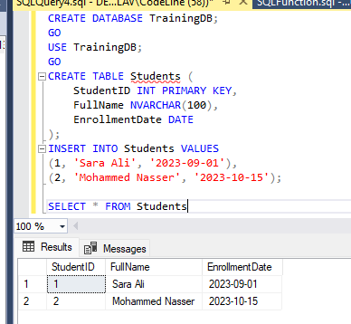
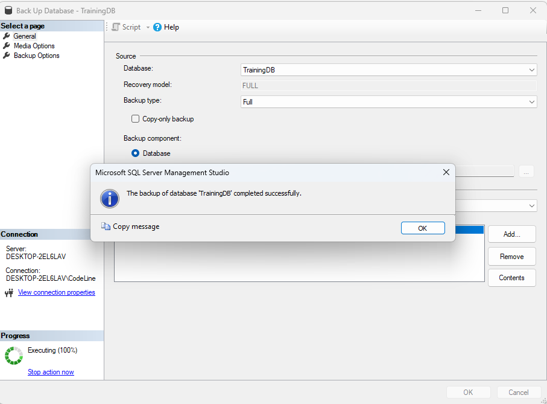
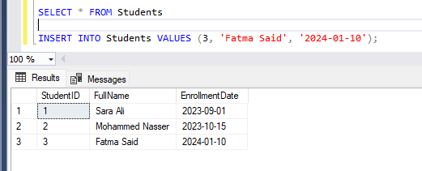
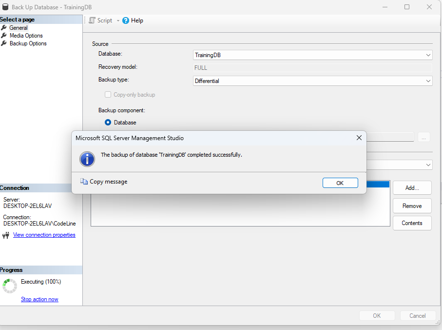
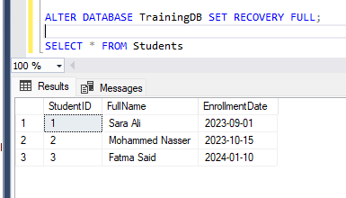
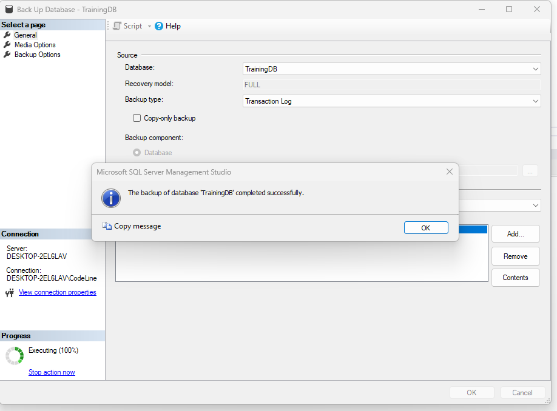
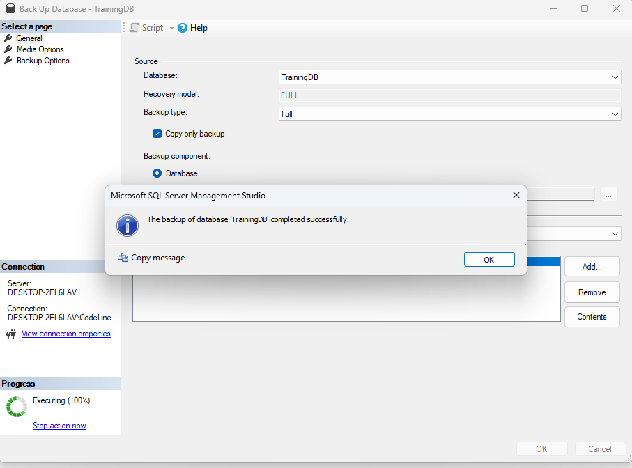

# __SQL Server Backup Types__

================Part 1: Research Task================

 |Types of backups|Definition|When It Is Used|What It Includes|Pros|Cons|Real-World Scenario|
 |----------------|---------|----------------|----------------|-----|----|------------------|
 |Full Backup |A full backup is a complete copy of the entire database, including all data, tables, indexes, stored procedures, and system information.| * As the baseline for all other backups. *Typically scheduled daily in most environments.|* Entire database (all data, objects, system tables). *Part of the transaction log to ensure consistency. | *Simple to restore. *Complete snapshot of the database |*Time-consuming for large databases. *Storage-intensive.| Banking System: Taken every night to ensure a full, restorable image of all customer accounts and transactions.|
 |Differential Backup|A differential backup includes only the changes made to the database since the last full backup.| Between full backups, typically multiple times a day|All data changed since the last full backup|*Smaller and faster than full backup. *Useful for minimizing recovery time when used with full backup|  *Grows over time until next full backup. *Requires full backup to restore|E-learning Platform: Taken every 4 hours to capture new student activity and course updates without a full backup load.|
 |Transaction Log Backup|A transaction log backup captures all transactions that occurred since the last transaction log backup.| Frequently (every few minutes) in high-availability environments.|All changes since the last transaction log backup.| *Supports point-in-time recovery. *Minimizes data loss risk.| *Cannot be used alone (needs full + differential). *Requires full recovery model.| Online Ticketing System: Taken every 15 minutes to ensure no ticket sales are lost
 |Copy-Only Backup| A copy-only backup is an independent backup that does not affect the normal backup sequence or chain.| *For ad-hoc backups without affecting backup sequence.| Like full or transaction log backup but does not disturb the backup chain| *Safe for testing or manual exports. *No impact on regular backup routines| Not suitable for log chain recovery. *Must be handled manually in restore planning|Software Development QA: Developers take a copy-only backup to test database changes without disrupting production backups.|
 | File/Filegroup Backup |A file or filegroup backup targets specific data files or filegroups within a database, instead of backing up the entire database.| *For very large databases with filegroups. *Used in piecemeal restore scenarios |One or more specific files/filegroups from the database.| *Efficient for large databases. *Enables partial restore (useful in large systems).| *Complex to manage and restore. *Requires detailed planning.| Enterprise Data Warehouse: Back up only the "Sales" filegroup nightly to reduce backup window.|

 
<ins>**SQL Server Backup Types – Comparison Table** </ins>

 | **Backup Type**     | **Size** | **Speed** | **What It Includes**               | **Best For**                              |
| ------------------- | -------- | --------- | ---------------------------------- | ----------------------------------------- |
| **Full**            | Large    | Slow      | Entire database + part of the log  | Daily recovery baseline                   |
| **Differential**    | Medium   | Fast      | Changes since the last full backup | Frequent interim backups                  |
| **Transaction Log** | Small    | Fastest   | Changes since the last log backup  | Point-in-time recovery                    |
| **Copy-Only**       | Varies   | Varies    | Same as full or log (independent)  | Ad-hoc backups without affecting schedule |
| **File/Filegroup**  | Varies   | Varies    | Specific files or filegroups only  | Very large databases with modular design  |

------------------------------------------------
==================Part 2: Practice Tasks (using a test database like TrainingDB)==================

Step 1: Create Test Database

 

Step 2 : Perform Backup Operations

1. Full Backup 

2.Insert New Record(simulate data change)

 

3. Differential Backup

 

4. Transaction Log Backu

* First make sure Recovery Model is FULL

 

* Now backup the log

 

5. Copy-Only Backup 

==============Part 3: Real-World Scenario Simulation==============

